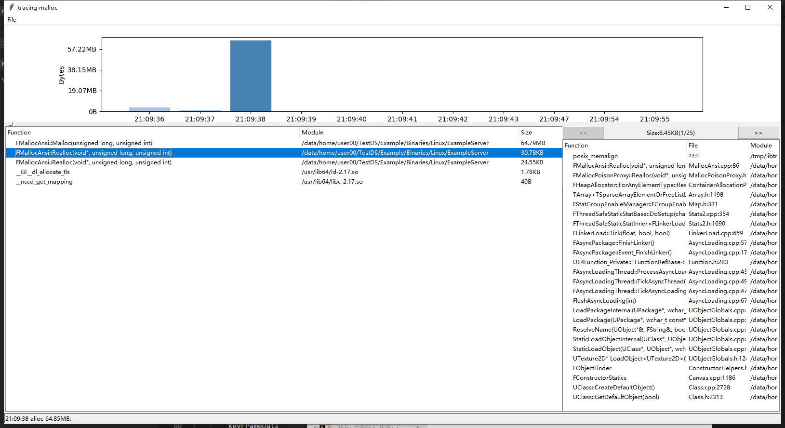

# tracing_malloc

tracing_malloc is a memory analyzer and memory leak detector for Linux C/C++. It's very convenient to use:

* No need to modify or recompile the target executable. It injects into the target process via LD_PRELOAD method to monitor memory allocation(such as malloc)
* Low performance cost of collecting time-based memory activity data compared with valgrind and memloax. It can be used for large projects like Dedicated Server of UE4.
* Realtime track of non-freed memory, including stack, allocation size and time.
* Visual analyzation tool, easy inspection of memory allocation based on time.

## Compile

1. Run ./build_libunwind to install libunwind
2. Create a temporary dir and run cmake ${proj}/src temp_dir
3. make

## How to use

For example, in order to analyze ./alloc_comparison whose command line arguments are "4096 1024 2"

Run tracing.py --collection_interval_ms=1000 ./alloc_comparison 4096 1024 2

This will generate tracing.malloc.pid.time files in current directory for every 1000ms. An example file name is tracing.malloc.4098.2019_12_05_09_56_43_069546

After the process quits, a tracing.malloc.pid is generated, like tracing.malloc.4098

## How to analyze

To see unfreed memory and its allocation time, use ${proj}/tools/allocation/main.py to open tracing.malloc.pid or tracing.malloc.pid.time.

## Performance

[ExamplePlugin](./tools/ExamplePlugin)

* `time ./Example/Binaries/Linux/ExampleServer Example -ansimalloc` 

    real    0m5.375s
    user    0m0.760s
    sys     0m0.212s

* `time LD_PRELOAD=/tmp/libtracing_malloc.so ./Example/Binaries/Linux/ExampleServer Example -ansimalloc`

    real    0m6.888s
    user    0m1.868s
    sys     0m0.740s

* `time valgrind ./Example/Binaries/Linux/ExampleServer Example -ansimalloc`

    real    0m53.204s
    user    0m48.016s
    sys     0m1.300s
